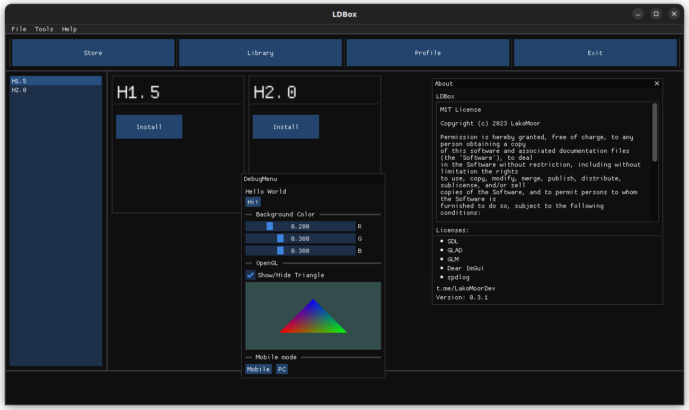

# **📦 LDBox**    

This is an attempt to create a [Open Source](https://en.wikipedia.org/wiki/Open-source_software) project of the [Qt](https://www.qt.io/) type without using proprietary software. At the moment, one person is engaged in the project.          
The project was originally conceived to create a [Steam](https://store.steampowered.com/about/) - like application for the LakoMoor Dev game called [**HOLODILNIK**](https://t.me/LakoMoorDev).

# Features:

- Open source
- Cross-platform
- Used OpenGL
- Dear ImGui based

# Current tasks:

- Converted into a library
- Make like Game Engine
- Find people :D

# Getting started
## Building ReadMe
[Building](docs/README.md)

# State
A Work-In-Progress.

# Used libraries
* [LDBox](https://github.com/lakomoor/LDBox)
  * [SDL2](https://libsdl.org/)
  * [spdlog](https://github.com/gabime/spdlog)
  * [GLAD](https://glad.dav1d.de/)
  * [GLM](https://github.com/g-truc/glm)
  * [Dear ImGui](https://github.com/ocornut/imgui)

# License

`LDBox` source code is licensed under the terms of the [MIT License](https://github.com/LakoMoor/LDBox/blob/master/LICENSE)

# Donate
**ETH:** `0xe7b4E36eAc8761fc5C8bb6bDc25B4F03dd165Add` 

**TON:** `EQApmFavJfxYY_lKGllr2vN-NvpZrqlqPch4QJ27vBGOhE_7`

**BNB:** `0xddd760012437597069cf727c6f73d0b8275e94ec` (BEP20)

**BUSD:** `0xddd760012437597069cf727c6f73d0b8275e94ec` (BEP20)

**USDT:** `0xe7b4E36eAc8761fc5C8bb6bDc25B4F03dd165Add` (ERC20)

**USDT:** `TCgvvFwe1djeTmFAi1faBqNKEJMwMvDHMt` (TRC20)

